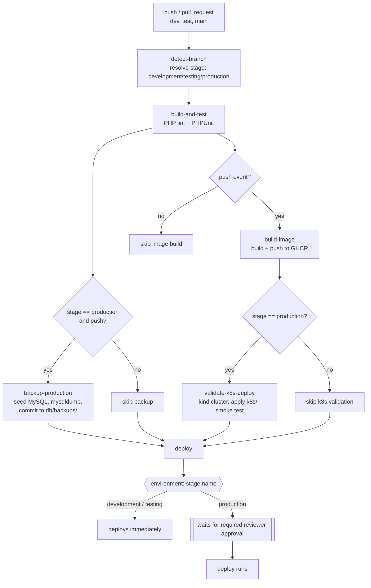

# cicd-approval-demo

A small PHP/MySQL login app used as a vehicle to demonstrate a branch-based
CI/CD pipeline with environment gating, automated database backups, and a
required-reviewer approval gate before production deploys.

## Pipeline



- **`dev` → `development`**, **`test` → `testing`**, **`main` → `production`**
  — resolved from the push ref (or PR base branch) in `detect-branch`.
- **`build-and-test`** PHP-lints the app and runs the PHPUnit suite
  (`AuthTest`, `RegistrationTest`; in-memory SQLite, no external DB needed).
- **`backup-production`** only runs for pushes to `main`: it spins up a
  throwaway MySQL service container, seeds it from `db/init.sql`, takes a
  `mysqldump`, and commits the dump into `db/backups/` in the repo.
- **`build-image`** runs for any push (dev/test/main), after `build-and-test`
  succeeds: builds the `Dockerfile` image and pushes it to
  `ghcr.io/<owner>/<repo>`, tagged with the commit SHA (always) and `latest`
  (main only).
- **`validate-k8s-deploy`** (main/production only) spins up a throwaway
  `kind` cluster on the runner, loads the image `build-image` just pushed,
  applies the manifests in `k8s/`, and smoke-tests the app through the
  Kubernetes Service — proving the app is genuinely deployable to
  Kubernetes without needing a real cluster or cloud account.
- **`deploy`** targets a GitHub Environment named after the stage
  (`development`, `testing`, `production`). The `production` environment has
  a required reviewer configured in repo settings, so every production
  deploy pauses for manual approval before it runs. It currently just echoes
  the image reference it would ship.

## App

- `public/login.php` — login form, calls `Auth::attempt()`
- `public/register.php` — signup form, calls `Registration::register()`
- `public/dashboard.php` — post-login view: your account details + a live
  list of registered users
- `src/Auth.php` — credential-checking logic (bcrypt via `password_verify`),
  covered by `tests/AuthTest.php`
- `src/Registration.php` — signup validation + user creation (bcrypt via
  `password_hash`), covered by `tests/RegistrationTest.php`
- `db/init.sql` — schema + seed data (`users`)

Demo accounts: `admin` / `admin123`, `demo` / `demo123`.

## Run locally with Docker

Requires Docker and Docker Compose.

```bash
docker compose up --build
```

This starts the app (Apache + PHP 8.2) and a MySQL 8 container seeded from
`db/init.sql`. Open **http://localhost:8000/login.php**.

- Log in with a demo account: `admin` / `admin123` or `demo` / `demo123`.
- Or click "Need an account? Register" to create your own via
  `register.php`, then log in with it.
- After logging in you land on `dashboard.php`, which shows your account
  details and a live-from-the-database list of registered users.

Stop the stack with `Ctrl+C`, or `docker compose down` (add `-v` to also
drop the MySQL data volume and start fresh next time).

Every push to `dev`, `test`, or `main` also publishes an image to this
repo's **GHCR package** (`ghcr.io/<owner>/<repo>`), tagged with the commit
SHA (and `latest` for `main`) — see the `build-image` job above.

## Run on Kubernetes locally (kind)

Requires Docker, [`kind`](https://kind.sigs.k8s.io/), and `kubectl`. This
mirrors exactly what the `validate-k8s-deploy` pipeline job does in CI.

```bash
docker build -t cicd-approval-demo:local .
kind create cluster --name cicd-demo
kind load docker-image cicd-approval-demo:local --name cicd-demo

kubectl apply -f k8s/namespace.yaml
kubectl create configmap mysql-init -n production \
  --from-file=init.sql=db/init.sql --dry-run=client -o yaml | kubectl apply -f -
kubectl apply -f k8s/mysql-secret.yaml
kubectl apply -f k8s/mysql-deployment.yaml
kubectl apply -f k8s/mysql-service.yaml
sed 's|IMAGE_PLACEHOLDER|cicd-approval-demo:local|' k8s/app-deployment.yaml | kubectl apply -f -
kubectl apply -f k8s/app-service.yaml

kubectl -n production rollout status deployment/mysql
kubectl -n production rollout status deployment/app

kubectl -n production port-forward svc/app 8080:80
```

Then open **http://localhost:8080/login.php** — same demo accounts and
register/login/dashboard flow as the Docker Compose setup. Tear down with
`kind delete cluster --name cicd-demo`.

The `k8s/` manifests: `namespace.yaml` (a `production` namespace),
`mysql-deployment.yaml` + `mysql-service.yaml` (seeded via a ConfigMap
generated from `db/init.sql`, so the schema is never duplicated), and
`app-deployment.yaml` + `app-service.yaml` (the `IMAGE_PLACEHOLDER` is
substituted with the real `ghcr.io` image + SHA tag at apply time).

## Running locally without Docker

Requires PHP with `pdo_mysql`, and a MySQL server.

```bash
mysql -uroot -e "CREATE DATABASE logindemo"
mysql -uroot logindemo < db/init.sql

composer install
vendor/bin/phpunit

DB_HOST=127.0.0.1 DB_NAME=logindemo DB_USER=root DB_PASSWORD= \
  php -S 127.0.0.1:8000 -t public
```

Then open http://127.0.0.1:8000/login.php.
