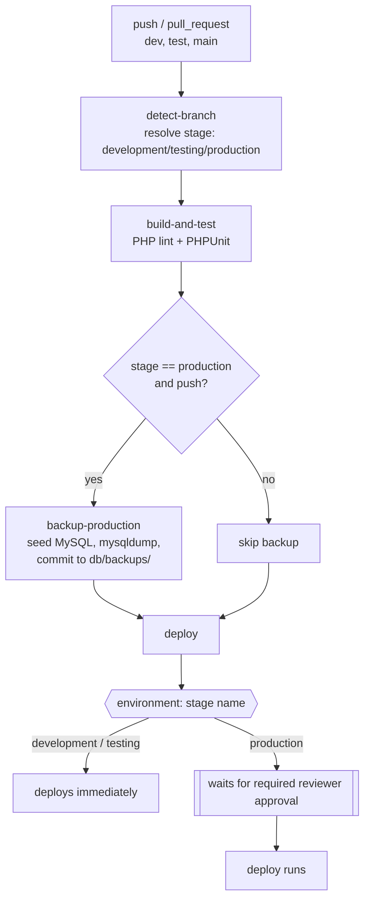

# cicd-approval-demo

A small PHP/MySQL login app used as a vehicle to demonstrate a branch-based
CI/CD pipeline with environment gating, automated database backups, and a
required-reviewer approval gate before production deploys.

## Pipeline



- **`dev` → `development`**, **`test` → `testing`**, **`main` → `production`**
  — resolved from the push ref (or PR base branch) in `detect-branch`.
- **`build-and-test`** PHP-lints the app and runs the `AuthTest` PHPUnit
  suite (in-memory SQLite, no external DB needed).
- **`backup-production`** only runs for pushes to `main`: it spins up a
  throwaway MySQL service container, seeds it from `db/init.sql`, takes a
  `mysqldump`, and commits the dump into `db/backups/` in the repo.
- **`deploy`** targets a GitHub Environment named after the stage
  (`development`, `testing`, `production`). The `production` environment has
  a required reviewer configured in repo settings, so every production
  deploy pauses for manual approval before it runs.

## App

- `public/login.php` — login form, calls `Auth::attempt()`
- `public/dashboard.php` — post-login view of the `customers`/`orders` tables
- `src/Auth.php` — credential-checking logic (bcrypt via `password_verify`),
  covered by `tests/AuthTest.php`
- `db/init.sql` — schema + seed data (`users`, `customers`, `orders`)

Demo accounts: `admin` / `admin123`, `demo` / `demo123`.

## Running locally

Requires PHP with `pdo_mysql`, and a MySQL server.

```bash
mysql -uroot -e "CREATE DATABASE logindemo"
mysql -uroot logindemo < db/init.sql

composer install
vendor/bin/phpunit

DB_HOST=127.0.0.1 DB_NAME=logindemo DB_USER=root DB_PASSWORD= \
  php -S 127.0.0.1:8000 -t public
```

Then open http://127.0.0.1:8000/login.php.
